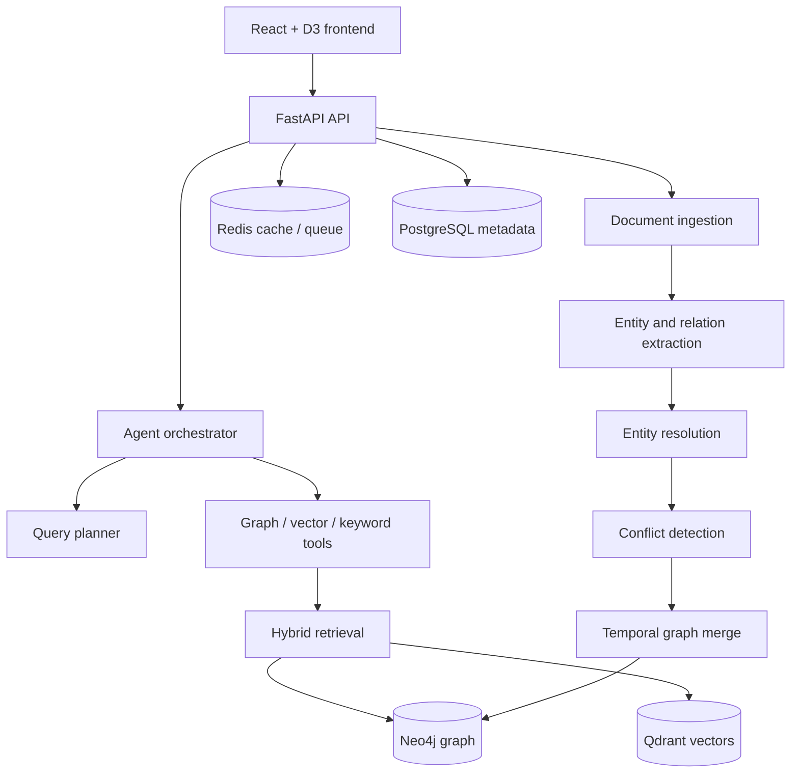

<p align="center">
  
</p>

<h1 align="center">EvoGraph</h1>

<p align="center">
  <strong>An evolving knowledge graph agent for temporal, source-grounded RAG.</strong>
</p>

<p align="center">
  <a href="https://evo-graph.vercel.app/">Live demo</a> |
  <a href="#why-evograph">Why EvoGraph</a> |
  <a href="#quick-start">Quick start</a> |
  <a href="#architecture">Architecture</a> |
  <a href="#roadmap">Roadmap</a>
</p>

<p align="center">
  
  
  
  
  
</p>

> 中文简介：EvoGraph 是一个面向 Agentic RAG 的知识图谱实验项目。它把文档切片、向量检索、知识图谱、时序关系、冲突检测和可视化放在同一个工程里，适合学习、二次开发和研究型原型验证。

## Why EvoGraph

Most RAG systems treat knowledge as static chunks. EvoGraph explores a different shape:

```text
documents -> entity/relation extraction -> temporal graph -> conflict detection
          -> hybrid retrieval -> multi-step agent reasoning -> grounded answer
```

That makes the project useful when the answer depends on changing facts, competing sources, or relationships across multiple documents.

Good fits:

- Competitive intelligence: track people, products, companies, and market events over time.
- Research synthesis: connect papers, claims, methods, and contradictory findings.
- Legal or policy analysis: keep versions, sources, and conflicts visible.
- Internal knowledge bases: detect stale facts instead of blindly adding more chunks.

## What You Can Try Today

- Interactive graph explorer built with React, TypeScript, and D3.js.
- Query console for agent-style answers with reasoning traces.
- Document upload UI with an evolution pipeline view.
- Conflict dashboard for temporal overlap and logical contradiction cases.
- Timeline view for graph snapshots and knowledge changes.
- FastAPI backend modules for graph retrieval, hybrid retrieval, LLM orchestration, and conflict detection.

Project status: EvoGraph is an early-stage prototype. The UI demo is available, and the backend contains the main module structure and several implemented reasoning/conflict components. Some ingestion, persistence, and production hardening paths are still in progress.

## Demo

- Live frontend: <https://evo-graph.vercel.app/>
- API docs after local backend startup: <http://localhost:8080/docs>

## Architecture



Core idea: answers should carry both graph context and provenance, and the graph should remember when facts were valid instead of overwriting history.

## Core Concepts

| Capability | What it means |
| --- | --- |
| Temporal relations | Relationships can carry `valid_from` and `valid_to`, enabling historical snapshots and "what was true then?" queries. |
| Conflict detection | Detects temporal overlap and logical contradictions so competing facts stay visible. |
| Agentic retrieval | A planner selects graph, vector, keyword, temporal, or causal tools instead of relying on one fixed retrieval path. |
| Hybrid ranking | Graph facts, semantic chunks, and keyword matches can be combined through reciprocal rank fusion. |
| Provenance-first answers | The answer path is designed around sources, confidence, and reasoning traces. |

## Tech Stack

| Layer | Stack |
| --- | --- |
| Backend | Python 3.11, FastAPI, Pydantic, SQLAlchemy |
| Agent / LLM | LangChain, OpenAI-compatible APIs, DeepSeek-compatible config |
| Graph | Neo4j 5.x |
| Vector search | Qdrant client |
| Metadata | PostgreSQL |
| Cache / queue | Redis, Celery |
| Frontend | React 18, TypeScript, Vite |
| Visualization | D3.js |
| Styling | Tailwind CSS |

## Quick Start

### Prerequisites

- Python 3.11+
- Node.js 18+
- Docker and Docker Compose

### 1. Clone the repository

```bash
git clone https://github.com/liu66-qing/EvoGraph.git
cd EvoGraph
```

### 2. Start local services

```bash
docker-compose up -d
```

This starts Neo4j, PostgreSQL, Redis, and Qdrant.

### 3. Configure environment variables

```bash
cp .env.example .env
```

Then edit `.env` with your LLM and embedding credentials:

```env
LLM_API_KEY=sk-your-key
LLM_BASE_URL=https://api.deepseek.com
LLM_MODEL_ID=deepseek-chat

EMBED_API_KEY=sk-your-embedding-key
EMBED_BASE_URL=https://dashscope.aliyuncs.com/compatible-mode/v1
```

### 4. Install and run the backend

```bash
pip install -e ".[dev]"
make run
```

Backend: <http://localhost:8080>

### 5. Install and run the frontend

```bash
cd frontend
npm install
npm run dev
```

Frontend: <http://localhost:5173>

### 6. Optional: start the worker

```bash
make worker
```

## API Overview

| Method | Endpoint | Purpose |
| --- | --- | --- |
| `POST` | `/api/v1/documents` | Upload a document and create an ingestion job |
| `POST` | `/api/v1/query` | Run an agent query |
| `POST` | `/api/v1/query/stream` | Stream an agent answer with SSE |
| `POST` | `/api/v1/query/causal` | Run a causal query |
| `GET` | `/api/v1/graph/entities` | Search entities |
| `GET` | `/api/v1/graph/entities/{id}/neighborhood` | Fetch an entity neighborhood |
| `GET` | `/api/v1/conflicts` | List knowledge conflicts |
| `POST` | `/api/v1/conflicts/{id}/resolve` | Resolve a conflict |
| `GET` | `/api/v1/timeline/snapshot` | Fetch a graph snapshot |
| `GET` | `/api/v1/admin/health` | Health check |
| `WS` | `/ws/query/{session_id}` | Realtime query updates |
| `WS` | `/ws/graph/updates` | Realtime graph updates |

## Repository Layout

```text
EvoGraph/
├── frontend/                 # React + TypeScript UI
├── src/evograph/
│   ├── agent/                # Planner, orchestrator, tool registry
│   ├── api/                  # FastAPI routes and websocket endpoints
│   ├── evolution/            # Extraction, resolution, conflicts, merging
│   ├── graph/                # Neo4j access layer
│   ├── ingestion/            # Document loaders and chunking
│   ├── retrieval/            # Graph, vector, keyword, and hybrid retrieval
│   ├── storage/              # Redis and vector store clients
│   └── tasks/                # Celery tasks
├── tests/                    # Unit, integration, and e2e test folders
├── docs/                     # Logo and demo notes
├── docker-compose.yml
└── pyproject.toml
```

## Development

```bash
make test          # run tests
make test-unit     # run unit tests only
make lint          # ruff + mypy
make format        # format and auto-fix
make frontend-build
```

## Roadmap

- [ ] Finish durable document persistence and ingestion job tracking.
- [ ] Add seeded demo data for one-command local exploration.
- [ ] Store and display provenance links for every generated answer.
- [ ] Expand source-disagreement conflict detection.
- [ ] Add a reproducible demo walkthrough.
- [ ] Add screenshots/GIFs for the README.
- [ ] Publish versioned releases with changelogs.

## Suggested GitHub Topics

`agentic-rag`, `knowledge-graph`, `rag`, `fastapi`, `neo4j`, `qdrant`, `d3js`, `react`, `llm`, `temporal-reasoning`, `conflict-detection`

## Contributing

Contributions are welcome. See [CONTRIBUTING.md](CONTRIBUTING.md) for setup notes, issue labels, and the recommended first tasks.

If this project helps your research or gives you ideas for graph-based RAG, a star helps others discover it too.

## License

Apache-2.0. See [LICENSE](LICENSE).
